# Lab 200 - Adding Update and Edit Pages

## Introduction

 This lab will walk you through adding pages to your application, adding data and editing data inside the Visual Builder Cloud Service.

## Objectives

Now that we have a display of our data, the next steps are to allow additions and edits of that data. This will allow users to add new wines as they become available and edit the inventory/reserved counts.

- Create Pages to Add and Edit Content
  - Create a page to allow users to add data
  - Create a page to allow users to edit data

## Required Artifacts

- This lab assumes that you have completed the [Lab 100](LabGuide100.md).

## **STEP 1** Create a New Page

1. In the **Designer View** of our app, click inside the list component but outside an individual item so that the List is selected and the **List View** tag is displayed in blue.

  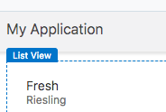

2. In the right hand menu select the **Quick Start** icon. Then click **Add Create Page**.

  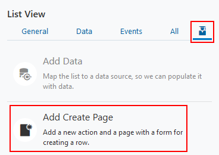

3. This will bring up a two step wizard. For the first step, we will click on the **Inventory** business object and click **Next**.

  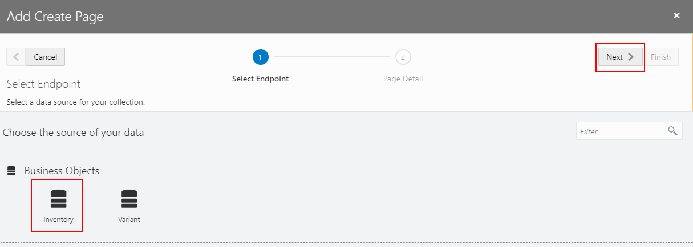

4. This will bring us to the **Page Detail** step where we can select the fields we would like to make available for creating new records. We'll select the following:

  ```
  name
  quantity
  reserved
  variant
  ```

  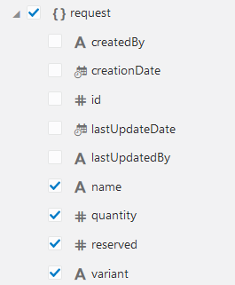

5. Also adjust the **Button Label** to simply "Create" and click **Finish**.

  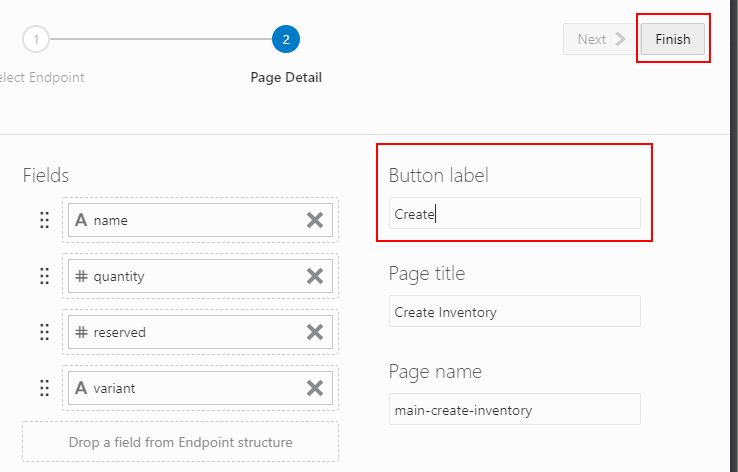

6. You will be presented with the main page of the app again. In order to view the new page  select the monitor icon, and expand **InventoryWebApp --> flows --> main** dropdown then select **CreateInventory**.

  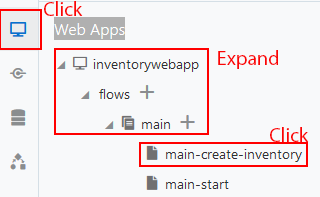

7. You should see a view of your new form appear.

  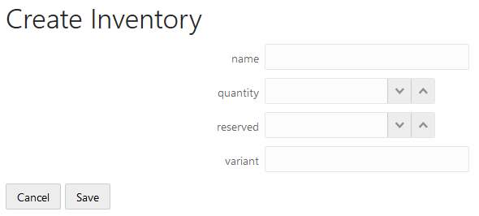

8. With this page created we can toggle to live mode right to interact with the app and add new data. To enable live mode, click the **Live** button above the right side panel.

  

9. Once in live mode, enter a new wine and click **Save**. You can enter your favorite wine or use the following example:

  ```
  name:  Ice
  quantity:  50 
  reserved:  0  
  variant:  white  
  ```

  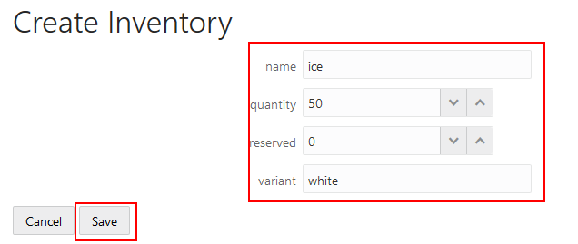


10. To view our new entry click on the tab for your main page.

  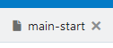

11. Then press the **Run** button.

  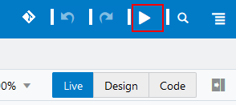

12. In the new browser tab you'll see our added data is in the list, and also note that there is a new **Create** button which was added for us by using the **Quick Start** guide. Buttons are automatically created to link pages inside the quick start guide.

  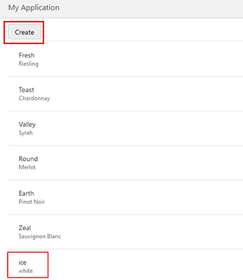

13. Close your new tab. Then exit Live mode by selecting the **Design** button.

  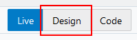

## **STEP 2** Add Edit Page

1. Now lets use the **Quick Start** guide to add an **Edit** page and a **Delete** button to our app's main page. Once again, click on the **List** component outside of a specific item so that the **List View** tag appears.

  

2. Now the **List View** detail panel should be displayed on the right. Click on the **Quick Start** icon and we'll see the links to add pages. Then click on **Add Edit Page** in the right panel.

  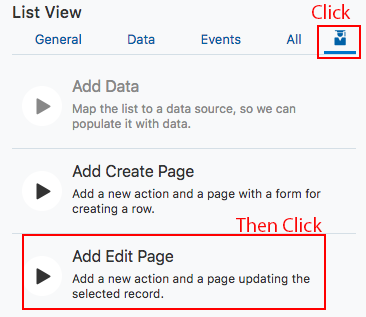

3.  Select the inventory business object as the read endpoint. Then click **Next**.

  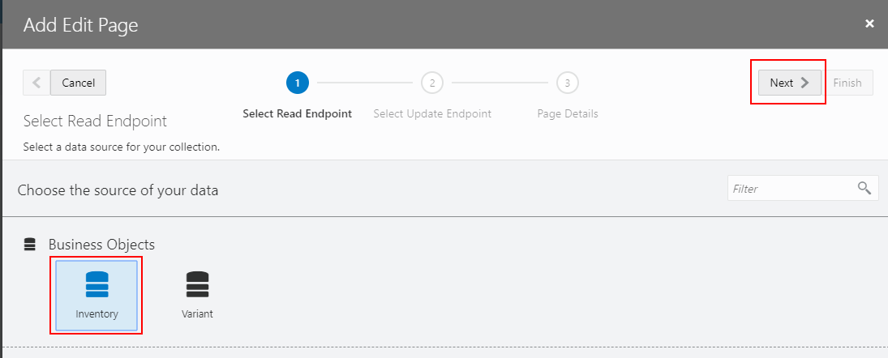

4. Select the Inventory business object as the update endpoint and click **Next**.

  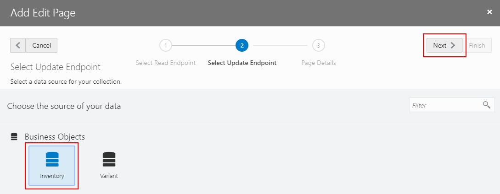

5.  In the **Page Details** step we'll select the fields we want displayed on our edit page, and then click **Finish**. Here we'll select:

  ```
  name
  quantity
  reserved
  variant
  ```

  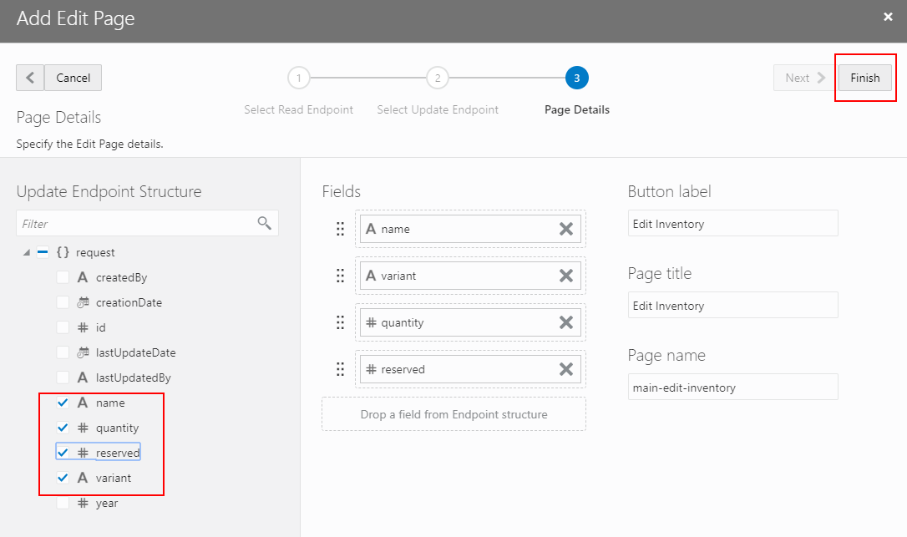

6. Once the creation process completes click on the **main-start** page tab.

  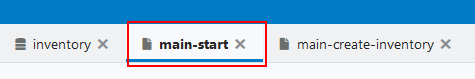

7. The open the **Live** mode by clicking the "Live" button above the right panel we can test our edit page.

   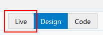

8. Select the row from the table you created earlier and press the **Edit Inventory** button. Note that the Edit Inventory button will become selectable once an item is selected in **Live** mode.

  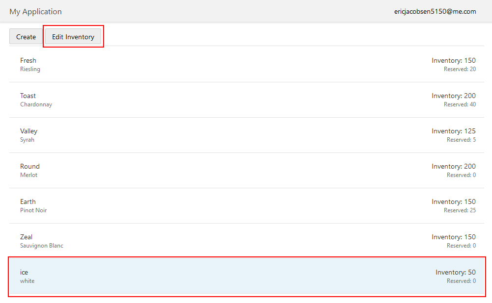
9. Change the quantity of your entry to 45 and press **Save**.

  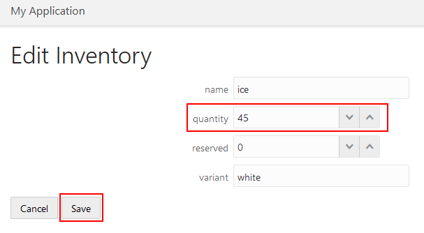

10. You will see the inventory level adjust on your main-start page.

  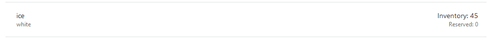

  **NOTE:** If the value does not immediate update press the reload button at the top of the page._

  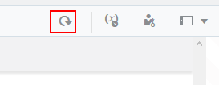

11. If we go back to our **main** tab we can now see our apps structure:

  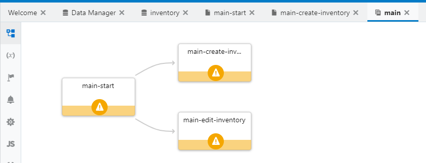

# Summary

We have now created an application in Visual Builder Cloud Service, added our business data, and added pages to display, add to, and edit our data all with very little need for code.

- You may proceed to [Lab 300](LabGuide300.md)
