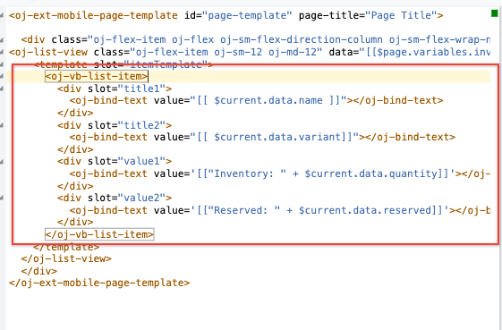

# Lab 300 - Creating a Mobile Application

## Introduction

This is the third of several labs that are part of the **Oracle Visual Builder Cloud Service workshop.** This lab will walk you through creating a mobile application and displaying inventory data.

## Objectives

- Create a mobile application
- Create mobile pages for an inventory items list and inventory items detail

## Required Artifacts

- This lab assumes that you have completed [Lab 100](LabGuide100.md) and [Lab 200](LabGuide200.md).

## **STEP 1**: Add a Mobile App to Our Application

1. In your application development console, click on **Mobile** icon in the far left panel.

  

2. Click the button **"+ Mobile Application"** to create a new mobile application instance.

  

3. You will be presented with the New Mobile Application window. In this window, name the mobile application ```InventoryMobileApp``` and choose the  bottom bar navigation style, then click **Next**.

  

4. Leave the page template as Custom and click on Finish.
  

5. You will see the new app created with the name **item1-start**. To keep the page clean close all your web application pages.

  

## **STEP 2**: Add Mobile App Pages

1. At this point you should be seeing a view of your mobile application in the development console. We'll now begin adding pages to display an inventory overview and item details.

  

The steps to add pages will be familiar if you have completed the web application creation lab in this series. The main page for our application is created for us automatically, so we will begin by adding components to display our data.

2. From the component list, drag a **List View** over to the mock phone and drop it on the page.

  

3. You should see the default list view component on your app. Next we'll customize the data displayed.

  

4. To associate our inventory data with the list, in the right panel select **Add Data**.

  

5. Select the Inventory business object and click **Next**.

  

6. Choose the top template at the top of the list and then click **Next**.

  

- For our **Fields** we will select data from the **Endpoint Structure** and drag them into the **Fields** boxes.
  
```
Position  name
Position  quantity
Position  variant
Position reserved
```

  

7. Your screen should look like the following before you click **NEXT**:

  

8. We don't need to define a query for our data, so we can click **Finish**.

  

9. At this point we have a mobile application that will display our data. Press the **run** button to view your mobile application running in a new tab.

  

10. You should see the following.

  

  Our app is displaying our data but our inventory/reserved counts aren't labeled. Let's add labels so users will know what these numbers mean. To do that we can customize the data displayed in our list view.

11. Close the new tab you just opened.

12. Click on **Edit**

  

13. Replace the existing code with the following for styling 


```
      <oj-vb-list-item>
        <div slot="title1">
          <oj-bind-text value="[[ $current.data.name ]]"></oj-bind-text>
        </div>
        <div slot="title2">
          <oj-bind-text value="[[ $current.data.variant]]"></oj-bind-text>
        </div>
        <div slot="value1">
          <oj-bind-text value='[["Inventory: " + $current.data.quantity]]'></oj-bind-text>
        </div>
        <div slot="value2">
          <oj-bind-text value='[["Reserved: " + $current.data.reserved]]'></oj-bind-text>
        </div>
      </oj-vb-list-item>
```

14. Code should look like this

  

15. Now our app displays a list of the available wines with their labeled inventory count and reserved count.

  

# Summary

  We have now created a mobile application in Visual Builder Cloud Service, added our business data. The next lab in the series will guide us through adding update and edit features to allow the app's users to update inventory counts from the app.

- You may proceed to [Lab 400](LabGuide400.md)
