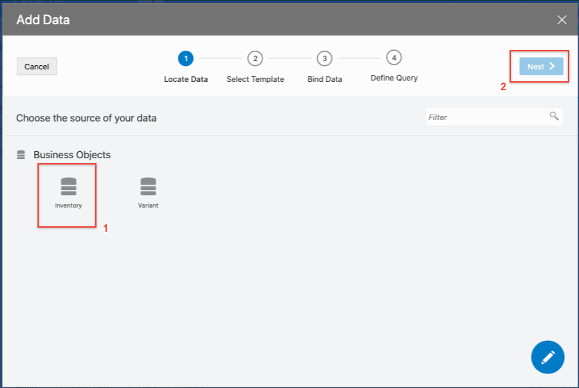

# Lab 400 - Incorporating REST Data into the Application

## Introduction

This lab will walk you through creating a mobile application page for viewing an inventory item's details and also incorporating REST service data into the mobile application.

## Objectives

- Create a mobile page for viewing inventory item details
- Add a REST service connection to the application
- Incorporate data retrieved from service connection into application

## Required Artifacts

- This lab assumes that you have completed [Lab 100](LabGuide100.md), [Lab 200](LabGuide200.md), [Lab 300](LabGuide300.md).

# Create Mobile Pages for Inventory Details

## **STEP 1**: Add a Inventory Details Mobile Page

Now we'll add a page to display inventory item details and once that is complete we'll incorporate data retrieved from a third party REST endpoint.

1. Open the item1-start page by expanding the **inventorymobileapp --> flows --> item1** menu and click the **item1-start**.

  

2. Navigate and open the **Page Structure** panel. This will make it easy to see all the components and select the List View component which we will work with next. Select the **List View** component from the **Page Structure**. With the List View component selected, open the **Quick Start** tab in the right panel and select **Add Detail Page**.

  

3. Select the Inventory Business Object and click **Next**.

  

4. This will bring us to the **Page Detail** step where we can select the fields we would like to make available for creating new records. We'll select the following:

  ```
   name
   quantity
   reserved
   variant
   ```

5. Then press finish.

  

6. We can now test the inventory item details page to see our newly created page. Click on the **Live** button to enable live mode and scroll down on the phone simulator to see your custom data entered in the prior lab.

  

7. Select a row from the list view on the mobile phone.

  

8. This will open our new Inventory Detail page and display the information from the item we have selected. You'll see that the page is already created for us including a back button that will navigate back to the overall inventory list.

  

9. Exit Live mode by clicking the **Design** button again.

  

10. Now we'll add an image to our detail page. From the component list in the left panel, drag an "Image" component onto the **item1-inventory-detail** page so that it is placed between the title bar and our "List" component.

  

11. You should now have a layout with a blank image on it.

  

12. Download the <a href="https://objectstorage.us-ashburn-1.oraclecloud.com/n/natdcshjumpstartprod/b/vbcs_workshop/o/wineGlass.png" target="wine">wine_glass.png</a> image to your local machine. If the image opens in a new tab, **right click** on it in your browser and **select save image as** to save to your local machine.

  

13. Back on the **Inventory Detail** page select the image component and select the **Data** tab.

  

14. Drag and drop the wineGlass.png image into the box below the source url field.  

  


15.  You should now see an image on our page.

  

## **STEP 2**: Add REST Service Connection

We will now add the Service Connection through which data will be retrieved from an external REST endpoint.

1. In your application development console, click on **Service Connections** icon in the far left panel.

  

2. Add a service connection by press the **"+ Service Connection"** button.

  

3. In the **Create Service Connection** window, we will choose **Define by Endpoint** as our source.

  

4. Select **GET** as the Method selected in dropdown menu. Then enter the following address in the URL field:

  ```
  <copy>
  http://jsonplaceholder.typicode.com/posts/1
  </copy>
  ```

5. In the right hand dropdown select **Get One** in the Action Hint dropdown menu, then click **Next**.

  

6. Click on the **Test** tab to try our connection and make sure it works. Inside the **Test** tab, click **Send** and review the data returned. If the data comes back successfully, click **Save as Example Response** to inform VBCS of the response structure.
  
  

7. Check the **Response** tab to see the response is now in the "Example" text area, then click **Create**.

  

8. Once created, the development console will display the tab of the new service connection.

  

9. Now that the connection is configured we'll add the response data to our detail page. To do so we'll set up a variable on the page to store the response and define an action to call the connection for the data.

## Displaying Data Retrieved from a REST Call

There are a few steps to integrating REST data into our app. First we'll need to set up a variable on our page to hold the response data from the REST call. VBCS comes with built in variable types but it also allows us to define our own custom types. The response from a REST call is a great use case for these custom type definitions. We'll create a new type from our service connection response structure which will be the type we use for our variable. So to summarize we will need to:

- Define a variable type based on the REST response
- Define a variable to hold our response data
- Create an Action Chain that retrieves our data and assigns it to the variable
- Configure an event that will trigger our action chain and make the data available via the variable


## **STEP 3**: Define Custom Variable Type

1. In the left panel of our developer console, select the mobile menu icon, then expand the **flows --> item1** page.

  

2. Select the **(x)** icon to display the variables of that flow. Select the **Types** tab.

  

3. Click the **+ Type** button on the center of the page.

  

4. Choose the **From Endpoint** selection choice.

  

5. For the type's endpoint expand **Service Connections > Posts** and choose **GET /1** and click **Next**.

  

6. In the **Endpoint Structure** step, check the box next to **{}Response** to select all the items in the response structure. Click **Finish**.

  

## **STEP 4**: Create Variable

We now have our type that will be used in our variable definition, let's set up our variable.

1. Go back to the **Variables** tab and click on the **+ Variable** button to begin creating a variable.

  

2. In the new variable window that opens, enter:

  ```
  <copy>
  itemDescription
  </copy>
  ```
  as the new variable's Id and choose our newly created **get1** from the dropdown menu as the type, then click **Create**.

  

3. You'll now see the variable listed in the **item1** flow's variable list. This gives us a place to store the retrieved data and a reference we can use to store it and retrieve it from the app.

  

## **STEP 5**: Define Action Chain

Now that the variable which will hold our response is created we can define the Action Chain that will retrieve the data from our Service Connection and store it in the variable.

1. Open **Actions** and click the **+ Actions Chain** button.

  

2. Set the Id of the action chain as:

  ```
  <copy>
  retrieveItemDescription
  </copy>
  ```

  and click **Create**.

  

3. You should now see the Action Chain configuration tab displayed. This is where we'll set the steps it should perform. You'll see on the left, there is a panel of pre-created action templates ready to use that we can drag onto the chain.

  

4. For our purposes we'll need two steps, first call a REST endpoint and second, assign the response to a variable. Drag the icon for **Call Rest Endpoint** onto the "plus sign under the **Start** icon in the chain.

  

5. In the right panel, click **Select Endpoint**

  

6. In the **Select Endpoint** window, expand **Service Connections > Posts** and select **GET** then click **Select**.

  

7. For the next step in the chain, we'll assign the response to our variable. In the list of action templates in the left panel, drag **Assign Variables** onto the plus sign at the bottom of the chain.

  

8. In the right hand pane click on the **Assign** link.

  

9. Clicking this will open the Map Variables To Parameters window.

  

10. Under the **Sources** column on the left, expand "callRestEndpoint1" and drag "body" over and drop it onto the "itemDescription" under **Flow** in the **Target** column on the right . When you drop it on the "itemDescription" you should get a line drawn between the items. Once the line appears click **Save**.

  

11. You should see the action as mapped in the right hand pane before proceeding to the next step.

  

## **STEP 6**: Bind Action Chain to App Event

The action chain is now ready to do it's work. All we need to do is tell our app what event should be used to trigger this action chain.

1. Click on the **InventoryDetail** tab in the left hand pane.

  

2. Then drag a button from the components column onto the page between the image and the list components.

  

3. In the button's configuration panel on the right side change the Text from button to ```More Info``` and choose the **Full** chroming option to make our button stand out a little more.

  

4. Next click the **Events** tab. Once on the Events page, click the **+ Event Listener** button to begin linking our action chain to an event.

  

5. VBCS allows us to quickly add events to our buttons. Choose **Quick Start: 'ojAction'** to click event to the button.

  

6. Drag the **Call Action Chain** from the action collection panel on the left to the bottom of the chain.

  

7. Then click the **Action Chain ID dropdown** button in the right panel and select **retreiveItemDescription**

  

8. Our pieces are all tied together, when the button is clicked on the inventory detail page it will trigger our action chain that in turn calls our service connection and stores the response of that call in our variable. All that's left to do now is display the data stored in the variable in our app.

## **STEP 7**: Display REST Response Variable Data

1. Navigate back to the **item1-Inventory-detail** tab.

  

2. Drag a "Text" component from the left column into the **Inventory Detail** page. You'll see a text box with a placeholder message of "Bind Text."

**NOTE:** If "Bind Text" does not appear in the page structure you can find it by selecting **Code** to the right of **Live** and **Design Mode** then selecting the text line from the code.

  

3. Now we'll set the text to be the data retrieved from the REST call. In the right hand navigation panel paste the following into the value field.

```
<copy>
{{ $flow.variables.itemDescription.body }}
</copy>
```


4. Let's test our button. Enable **Live** mode by clicking on the "Live" button in the top right corner.

  

5. Once in **Live** mode, click an item in the list, then when the **itemDetail** page loads test our button to verify it displays our new information.

  

- **This completes Lab 400 and the Workshop**
