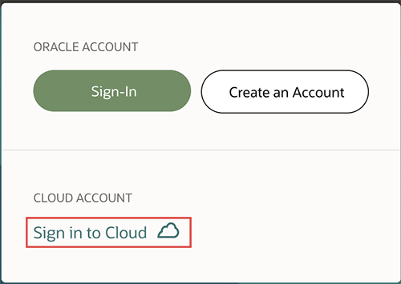
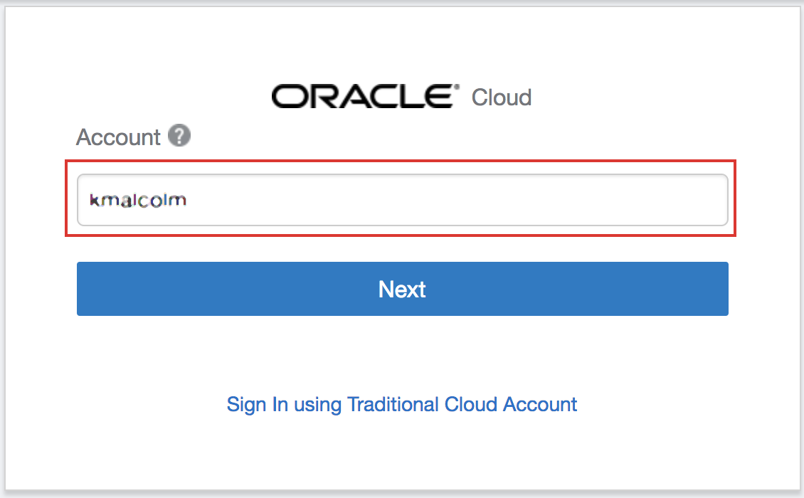
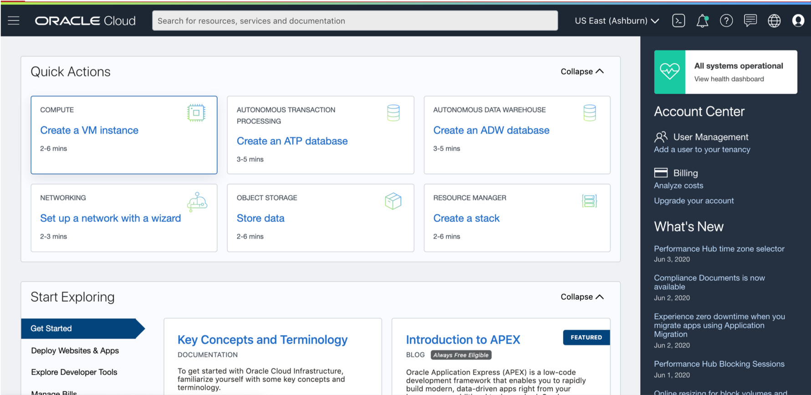

# Lab 50 - Provisioning a New Visual Builder Cloud Service

## Introduction

During this lab we will take your new trial account and show you how to provision all the required components for a new   Visual Builder Cloud Service.

## Objectives

- Login to Your Cloud Account
- Provision a New Instance

## **STEP 1:** Log into OCI Tenancy

   Log in to your OCI dashboard and retrieve information required to create resources.

1. From any browser go to oracle.com to access the Oracle Cloud.

    [https://www.oracle.com/](https://www.oracle.com/)

  

2. Click the icon in the upper right corner.  Click on **Sign in to Cloud** at the bottom of the drop down.   

     

3. Enter your **Cloud Account Name** in the input field and click the **Next** button.  *NOTE:  Do NOT click the Sign-In button, this will take you to Single Sign-On, not the Oracle Cloud*

  

4. Enter your username (this may be your email address) and password and click on **Sign In**.  **Note this is NOT your email. This is the name of your tenancy noted in the email you received during signup**

  

5. Once you log in you will see a page similar to the one below. Click on "Infrastructure Dashboard."

  

## **STEP 2**: Create a New Instance

1. Click on left Hamburger menu, Platform services and then scroll down click on Visual Builder.

  

2. Next Select the **Create Instance** button on the page.

  

3. On the next screen set your instance name, enter a description and select  **No Preference** as your data center.

  

4. Review your information and press **Create**.

  

5. You will see the following screen once your request is submitted. Press the refresh button every few minutes to see if your instance is provisioned.

  

6. You should see your instance being created.

  

7. When you see the following screen you can proceed to the next step.

  

- You may proceed to [Lab 100](LabGuide100.md)
