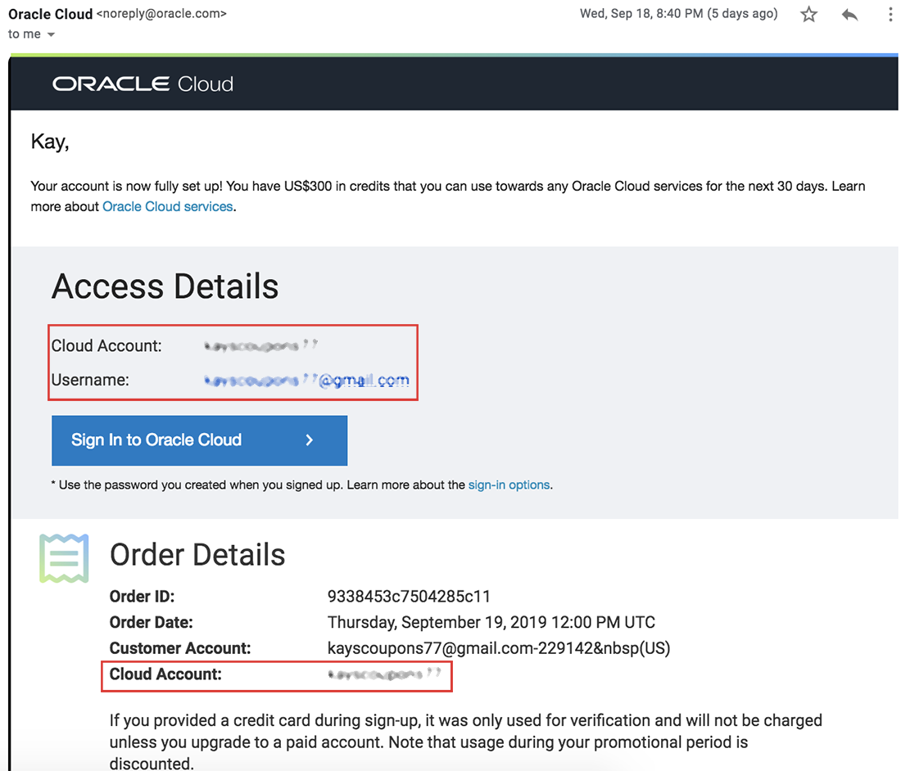

# Low Code Application Development

## Introductions
This Oracle Public Cloud Low Code Application Development workshop will walk you through the creation of a web and mobile application, during which you will create and customize an application with visual development tools.

**_To log issues_**, click here to go to the [github oracle](https://github.com/oracle/learning-library/issues/new) repository issue submission form.

### Acquire an Oracle Cloud Free Tier Account or Workshop Account

If you already have an account or an active trial/free tier account, you may skip this section.  If not, you will be creating all required infrastructure components within your Oracle Cloud Free Tier account.

- Bookmark this page for future reference.

## Sign Up for a Free Tier Account

- Open up a browser and click [here](https://myservices.us.oraclecloud.com/mycloud/signup?language=en&sourceType=:ex:tb:::RC_NAMK180921P00073:VBCS_HOL&SC=:ex:tb:::RC_NAMK180921P00073:VBCS_HOL&pcode=NAMK180921P00073) to sign up for an Oracle Cloud Account.
Follow the instructions to create your account.  Be sure to enter an email you can access.  

  

- Once you complete the signup, you will receive the **Your Cloud Account is fully provisioned** Email, make note of your **Username and Cloud Account Name**.   *Note: `Usernames are usually your email address.`*  You can login by clicking the Sign In button or access it from any browser.

    

## Login to Oracle Cloud Account

- From any browser go to oracle.com to access the Oracle Cloud.

    [https://www.oracle.com/](https://www.oracle.com/)

    

- Click the icon in the upper right corner.  Click on **Sign in to Cloud** at the bottom of the drop down.  *NOTE:  Do NOT click the Sign-In button, this will take you to Single Sign-On, not the Oracle Cloud*

        

- Enter your **Cloud Account Name** in the input field and click the **My Services** button. If you have a Free Tier account provisioned, this can be found in your welcome email. Otherwise, this will be supplied by your workshop instructor.

      

- Enter your **Username** and **Password** in the input fields and click **Sign In**.

     

  **NOTE**: You will likely be prompted to change the temporary password listed in the welcome email. In that case, enter the new password in the password field.

## Navigate to Lab 050

  - Use the Contents Menu to access the next lab. For example, to proceed to Lab 050, click **Lab 50: Setup Cloud Environment** from the menu on the right.

  

- Close the menu by clicking the X.

  

You're now ready to continue with **Lab 050**.
